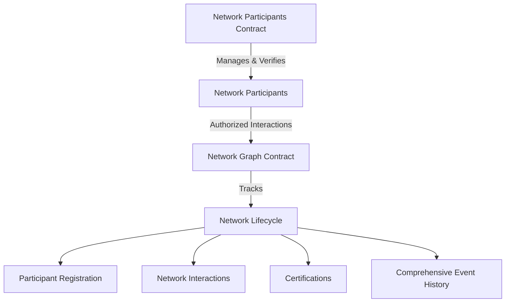

# Graph Tunnel

A decentralized network infrastructure smart contract system for managing participant networks and graph-based interactions on the Stacks blockchain.

## Overview

Graph Tunnel provides a flexible and secure framework for creating, managing, and tracking network interactions with robust participant verification and event tracking. The platform enables:

- Participant registration and role-based access control
- Dynamic network graph management
- Comprehensive event logging
- Secure, transparent network interactions
- Extensible certification and verification mechanisms

## Architecture

The platform consists of two interconnected smart contracts that provide a comprehensive network management solution:



### Network Participants Contract
- Manages participant registration and verification
- Implements role-based access control
- Tracks participant reputation
- Provides admin and verifier management

### Network Graph Contract
- Manages network interactions and tracking
- Records participant transfers and events
- Handles network certifications
- Maintains comprehensive interaction history

## Contract Documentation

### Farmo Participants Contract

Core functionality for managing supply chain participants:

#### Key Functions:
- `register-participant`: Self-registration for new participants
- `verify-participant`: Verifier approval of participants
- `update-participant-status`: Manage participant status
- `update-reputation-score`: Adjust participant reputation

#### Roles:
- Farmers
- Distributors
- Processors
- Retailers
- Verifiers
- Admins

### Farmo Registry Contract

Handles all product-related operations:

#### Key Functions:
- `register-product`: Create new product entries
- `transfer-custody`: Transfer product ownership
- `add-certification`: Add product certifications
- `record-supply-chain-event`: Log supply chain events

#### Features:
- Unique product identification
- Custody tracking
- Certification management
- Event history

## Getting Started

### Prerequisites
- Clarinet
- Stacks wallet
- Node.js

### Installation

1. Clone the repository
```bash
git clone <repository-url>
cd graph-tunnel
```

2. Install dependencies
```bash
npm install
```

3. Run local Clarinet chain
```bash
clarinet integrate
```

## Function Reference

### Participant Management

```clarity
(register-participant 
    (name (string-utf8 100))
    (role uint)
    (location (string-utf8 100))
    (metadata (string-utf8 256)))
```

### Product Management

```clarity
(register-product 
    (product-type (string-ascii 50)) 
    (harvest-date uint))
```

```clarity
(transfer-custody 
    (product-id uint) 
    (new-custodian principal) 
    (details (string-utf8 200)) 
    (location (optional (string-ascii 100))))
```

## Development

### Testing

Run the test suite:
```bash
clarinet test
```

### Local Development

1. Deploy contracts:
```bash
clarinet deploy
```

2. Initialize admin:
```clarity
(contract-call? .network-participants initialize-first-admin)
```

## Security Considerations

### Access Control
- Role-based permissions enforce proper authorization
- Only verified participants can perform operations
- Admin functions are restricted to authorized administrators

### Data Integrity
- Immutable history of all supply chain events
- Verified certifications from authorized authorities
- Timestamped custody transfers

### Limitations
- Certification authority verification is centralized
- Product data privacy is public on-chain
- Processing costs scale with supply chain complexity